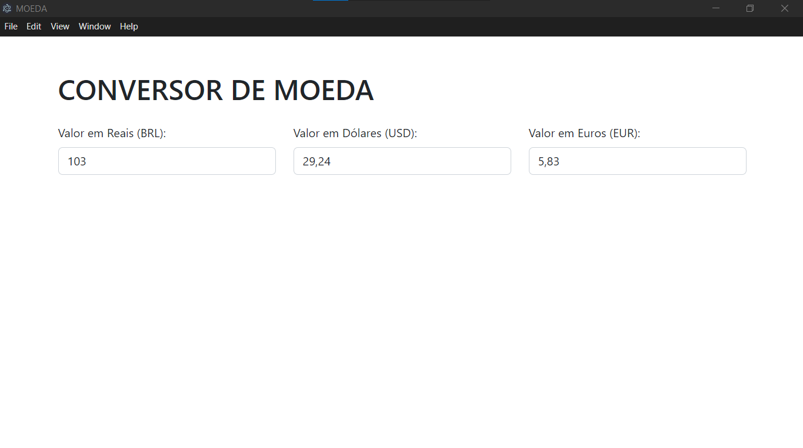

# APP CONVERSOR DE MOEDA
👨‍🏫CONVERSOR DE MOEDA EM REAIS, DOLARES E EUROS COM EXCHANGE RATE API, ELECTRONJS E BOOTSTRAP.

 <br>

## DESCRIÇÃO:
Este aplicativo web permite converter valores entre reais brasileiros (BRL), dólares americanos (USD) e euros (EUR) usando as taxas de câmbio mais recentes fornecidas por uma API externa.

## FUNCIONALIDADES:
- **Conversão de Moeda:** Permite converter valores digitados em tempo real entre BRL, USD e EUR.
- **Atualização Automática:** As taxas de câmbio são obtidas automaticamente da API sempre que o usuário executa uma conversão.

## EXECUTANDO O PROJETO:
1. **Instalar as dependências do projeto**:
   - No diretório `CODIGO`, abra o terminal ou prompt de comando e execute o seguinte comando:
     ```cmd
     npm install
     ```
   Este comando instala todas as dependências listadas no arquivo `package.json` do seu projeto.

2. **Obtendo o Token da API:**
   Para utilizar as taxas de câmbio fornecidas pela Exchange Rate API, você precisará de um token de API. Siga os passos abaixo para obter o seu token:

   1. **Registre-se no Exchange Rate API:**
      - Acesse o site [Exchange Rate API](https://www.exchangerate-api.com/).
      - Crie uma conta gratuita ou faça login se já tiver uma.

   2. **Obtenha o Token:**
      - Após o registro, você será direcionado ao painel de controle onde poderá ver o seu token de API.
      - Copie o token fornecido. Este token será usado para autenticar suas requisições à API.

3. **Coloque o Token no Código:**
   - Abra `./CODIGO/src/renderer.js` e substitua `SEU_TOKEN_AQUI` pelo seu token na linha 8:
   ```javascript
   const response = await axios.get('https://v6.exchangerate-api.com/v6/SEU_TOKEN_AQUI/latest/BRL');
   ```

4. **Executar o Aplicativo:**
   - Ainda no diretório `CODIGO`, abra o terminal ou prompt de comando e execute o seguinte comando:
     ```bash
     npm start
     ```
   Este comando inicia a aplicação, abrindo uma janela com o aplicativo pronto para uso.

5. **Usando App:**
   1. **Digite o Valor:**
      - Digite o valor que deseja converter nos campos de entrada correspondentes:
      - **BRL (Reais Brasileiros):** Digite o valor em reais.
      - **USD (Dólares Americanos):** O valor equivalente em dólares será calculado automaticamente.
      - **EUR (Euros):** O valor equivalente em euros será calculado automaticamente.

   2. **Visualize a Conversão:**
      - Assim que você digitar ou modificar um valor em qualquer um dos campos (BRL, USD ou EUR), o aplicativo irá automaticamente calcular e exibir os valores convertidos nos outros campos.

   3. **Erros de Conversão:**
      - Se ocorrer algum erro ao tentar converter a moeda (por exemplo, problemas de conexão com a internet ou falhas na API de taxa de câmbio), uma mensagem de erro será exibida no console do navegador.

## GERANDO O APLICATIVO:
1. **Configurar o electron-builder**:
   - Verifique se o `electron-builder` está configurado corretamente no `package.json` do projeto, na seção `"build"`. 

2. **Gerar o aplicativo**:
   - No diretório `CODIGO`, abra o terminal ou prompt de comando e digite o seguinte comando:
     ```bash
     npm run build
     ```
   Este comando utiliza o `electron-builder` para gerar o executável e o instalador.

3. **Localizar os arquivos gerados**:
   - Após a conclusão do processo de build, os arquivos gerados estarão localizados na pasta `dist/` dentro do diretório `CODIGO/`. Você encontrará o executável e o instalador do aplicativo.

## NÃO SABE?
- Entendemos que para manipular arquivos em `HTML`, `CSS` e outras linguagens relacionadas, é necessário possuir conhecimento nessas áreas. Para auxiliar nesse aprendizado, oferecemos cursos gratuitos disponíveis:
* [CURSO DE HTML E CSS](https://github.com/VILHALVA/CURSO-DE-HTML-E-CSS)
* [CURSO DE JAVASCRIPT](https://github.com/VILHALVA/CURSO-DE-JAVASCRIPT)
* [CURSO DE NODEJS](https://github.com/VILHALVA/CURSO-DE-NODEJS)
* [CURSO DE BOOTSTRAP](https://github.com/VILHALVA/CURSO-DE-BOOTSTRAP)
* [CURSO DE ELECTRONJS](https://github.com/VILHALVA/CURSO-DE-ELECTRONJS)
* [CONFIRA MAIS CURSOS](https://github.com/VILHALVA?tab=repositories&q=+topic:CURSO)

## CREDITOS:
- [PROJETO CRIADO PELO VILHALVA](https://github.com/VILHALVA)


